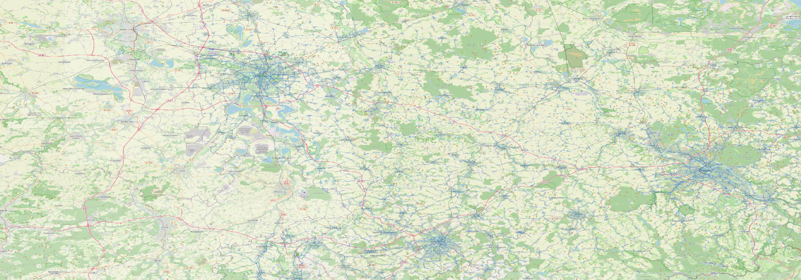
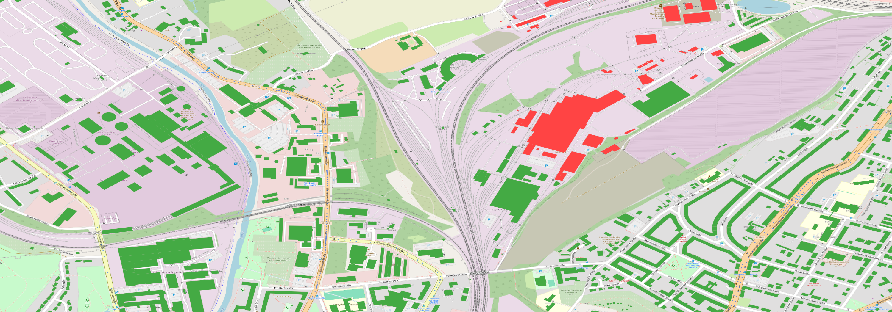

# saxony-fiber-coverage-postgis
Spatial analysis of fiber optic network coverage across Saxony using PostGIS, PostgreSQL and QGIS

# Saxony Fiber Coverage Gap Analysis
**Tools:** PostgreSQL · PostGIS · QGIS · OpenStreetMap  
**Dataset:** Geofabrik Saxony extract (1.79M buildings, 359K road segments)

## Project Overview
Spatial analysis simulating a fiber optic network across Saxony, Germany, 
to identify building coverage gaps. Directly relevant to fiber network 
planning workflows used in Glasfaserausbau projects.

## Methodology
1. Loaded OSM building and road data into PostGIS (EPSG:4326)
2. Reprojected to EPSG:25832 (UTM Zone 32N) for accurate metre-based analysis
3. Generated 478,218 simulated fiber nodes along primary/secondary/tertiary roads
   using `ST_LineInterpolatePoint`
4. Ran proximity analysis using `ST_DWithin` with 500m radius
5. Visualised covered vs. uncovered buildings in QGIS

## Key Findings
| Metric | Value |
|--------|-------|
| Total buildings analysed | 1,794,566 |
| Fiber nodes simulated | 478,218 |
| Buildings covered (500m) | 1,617,348 |
| Buildings in coverage gap | 177,218 |
| Coverage rate | **90.12%** |

## Performance Optimisation
- Identified that `::geography` cast disabled GIST spatial index
- Reprojected data to metric CRS (EPSG:25832) eliminating need for geography cast
- Query time reduced from ~7 seconds to under 1 second

## Maps
### Saxony Overview — Fiber Network Coverage

### Chemnitz Detail — Building-Level Coverage

🟢 Green = covered within 500m of fiber node  
🔴 Red = coverage gap  
🔵 Blue = simulated fiber nodes

## SQL Queries
| File | Description |
|------|-------------|
| [01_setup_reproject.sql](SQL Code/01_setup_reproject.sql) | CRS reprojection and index creation |
| [02_generate_fiber_nodes.sql](sql/02_generate_fiber_nodes.sql) | Fiber node generation along roads |
| [03_coverage_analysis.sql](sql/03_coverage_analysis.sql) | Coverage proximity analysis |
| [04_performance_optimization.sql](sql/04_performance_optimization.sql) | Query optimisation notes |

## Data Source
- Buildings & Roads: [Geofabrik Saxony](https://download.geofabrik.de/europe/germany/sachsen.html)
- Coordinate System: EPSG:25832 (UTM Zone 32N)
